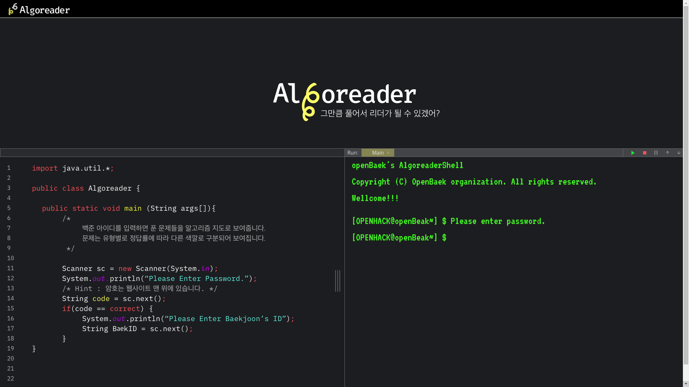
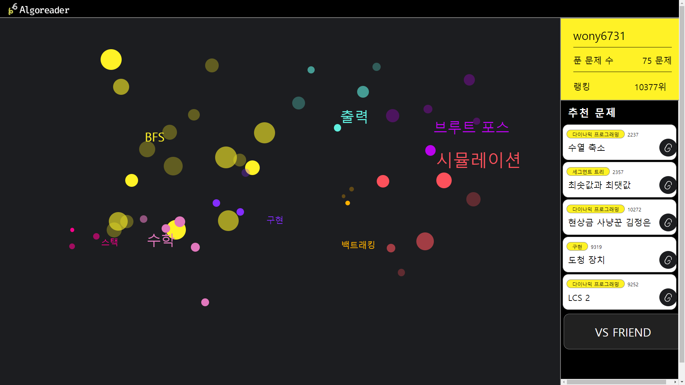
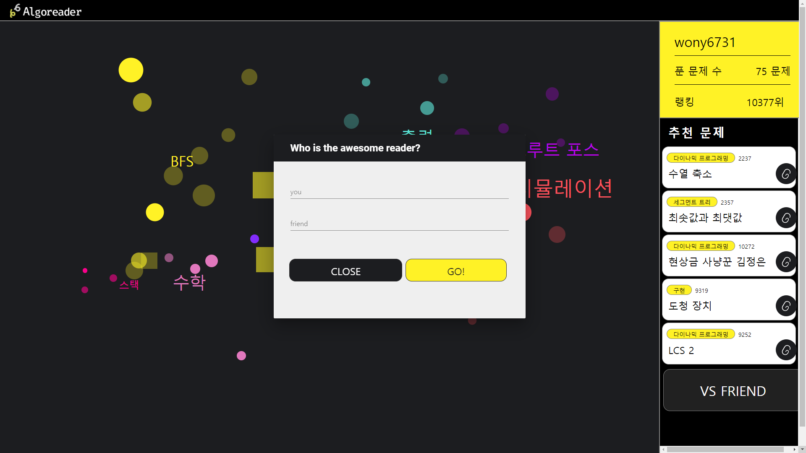
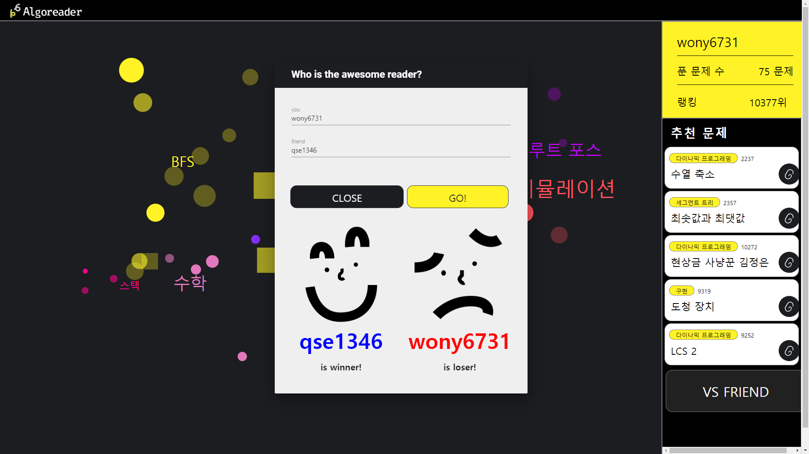

# openbeak-front

> A Vue.js project

## Page Image
#### Randing Page

#### Main Page




## 사용 dependency
- vue js
- vuex
- router
- axios
- store

## Randing Page

#### 유저 아이디 입력

- 유저 아이디를 입력하면 Server에 api 통신 후 알고리즘 버블 다이어그램을 위한 데이터 값을 받아오고 main page로 redirection 됩니다.

## Main Page

#### 1. 알고리즘 분류 및 시각화 

- 백준 알고리즘에서 유저가 푼 문제 정보를 가져와서 각 문제의 카테고리별로 군집화하여 보여줍니다.

  - motion 그래픽 라이브러리 mo.js를 이용하여 구현했습니다.

  - 문제 유형과 난이도에 따라서 원의 크기, 투명도를 다르게 주어 시각적인 효과를 주었습니다.

  - mo.js에서 폭발 효과를 주는 디자인 효과를 시도해보려 노력했습니다.

#### 2. 문제 추천

- 내가 푼 문제정보와 유사한 정답률을 가진 문제 리스트중 top 5를 추천해줍니다.
  - 다양한 문제 분류를 추천해주려 했으며, 링크를 통해 바로 백준 알고리즘 페이지로 넘어갈 수 있습니다.
  - 알고리즘을 어디서부터 시작해야할지 모르는 사람들을 위한 가이드가 됩니다.

#### 3. 나 VS 친구

- 같이 알고리즘을 공부하는 동료와 선의의 경쟁을 통해서 서로의 실력을 상승시킬 수 있고, 서로 모르는 부분을 학습할 수 있도록 유도합니다.


## Build Setup

```bash
# install dependencies
npm install

# serve with hot reload at localhost:8080
npm run dev

# build for production with minification
npm run build

# build for production and view the bundle analyzer report
npm run build --report

# run unit tests
npm run unit

# run e2e tests
npm run e2e

# run all tests
npm test
```

For a detailed explanation on how things work, check out the [guide](http://vuejs-templates.github.io/webpack/) and [docs for vue-loader](http://vuejs.github.io/vue-loader).